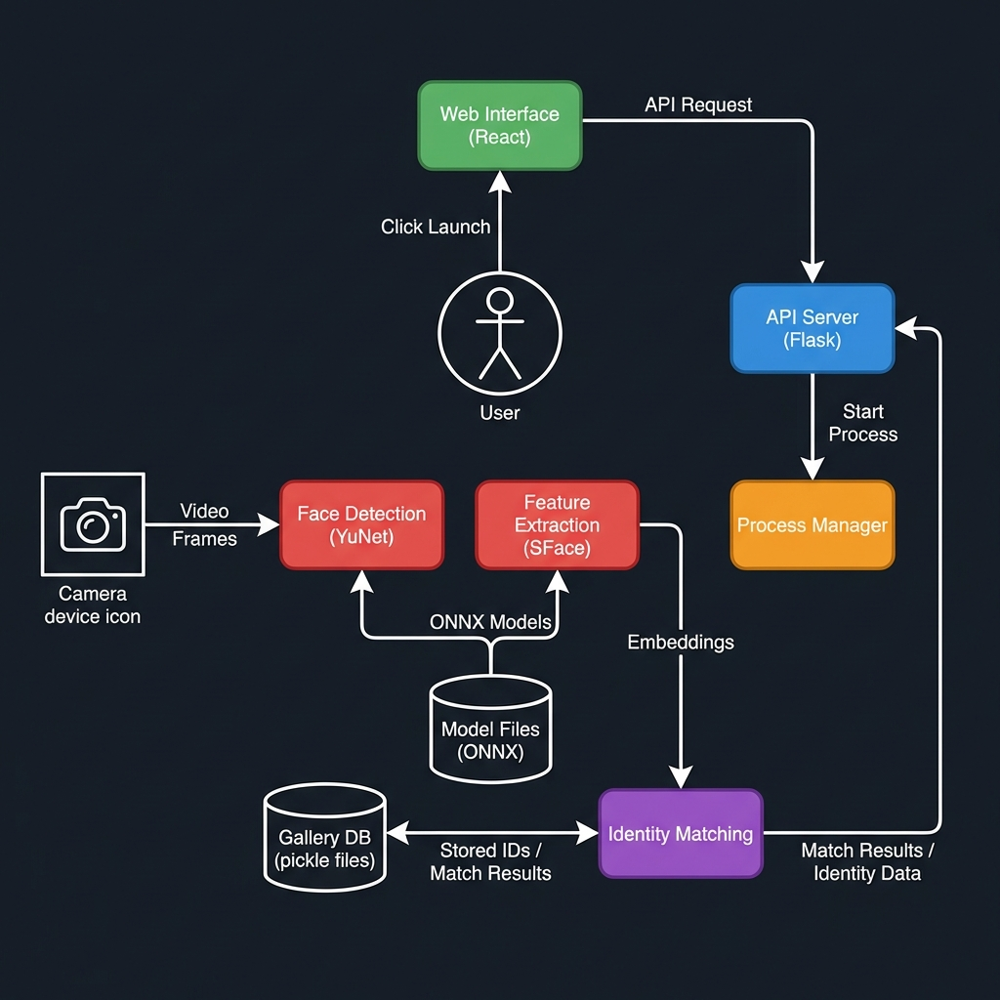
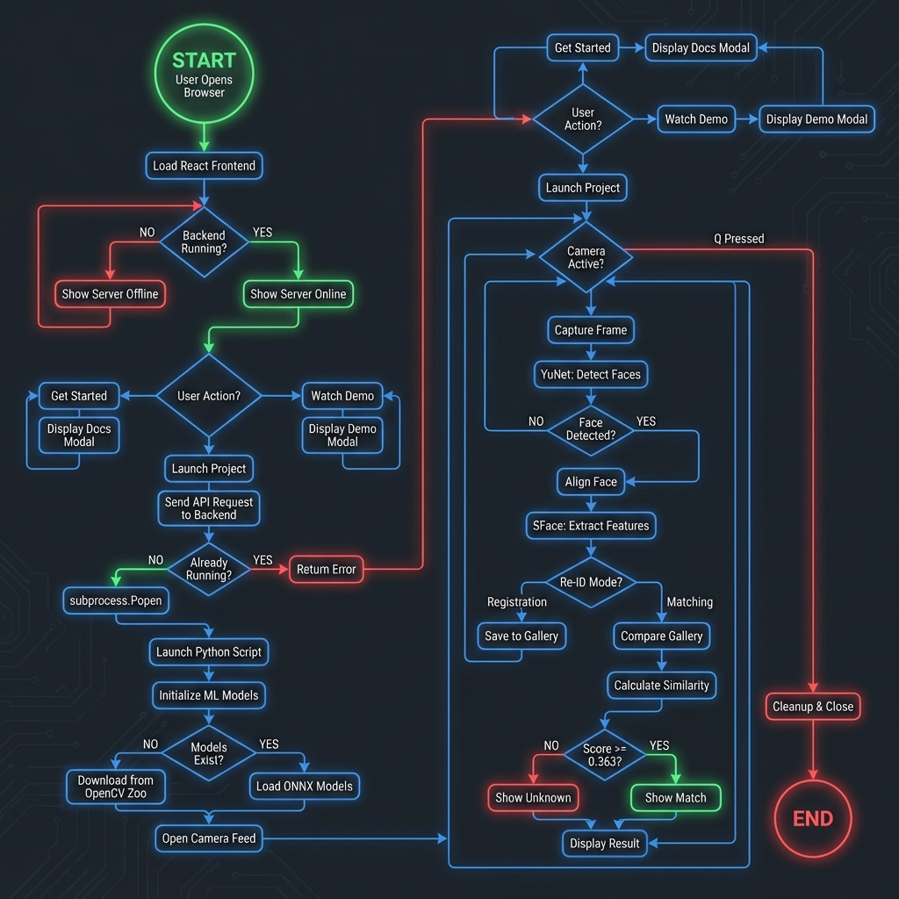
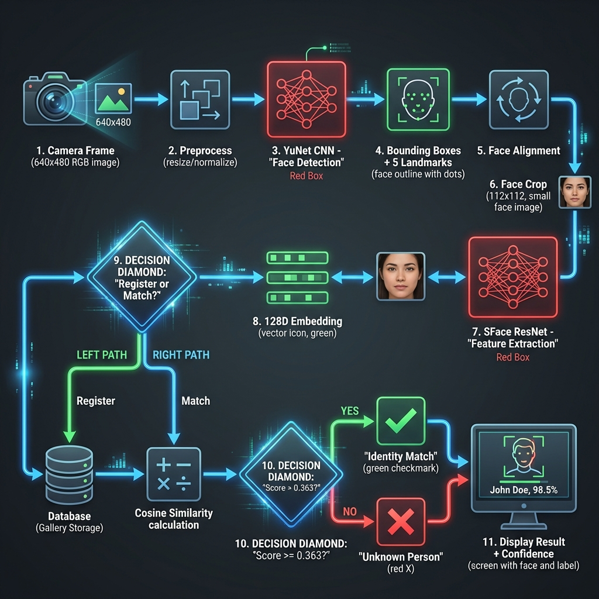
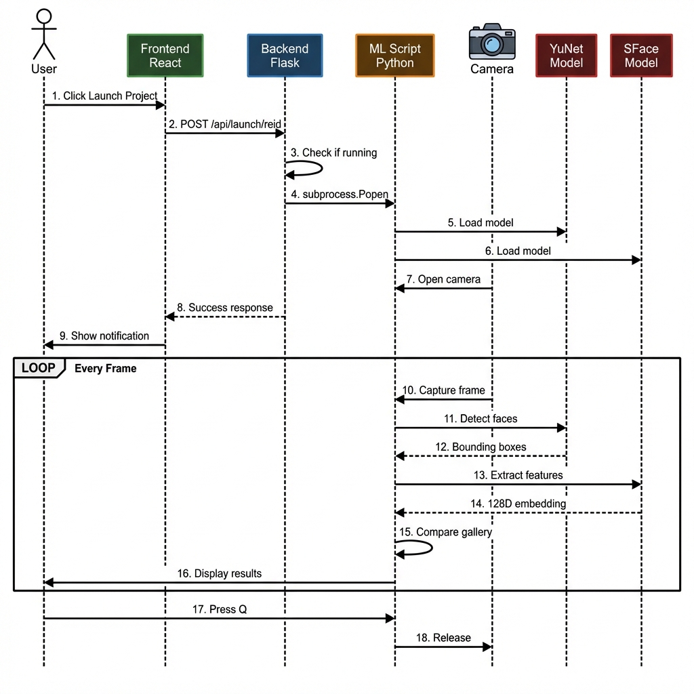
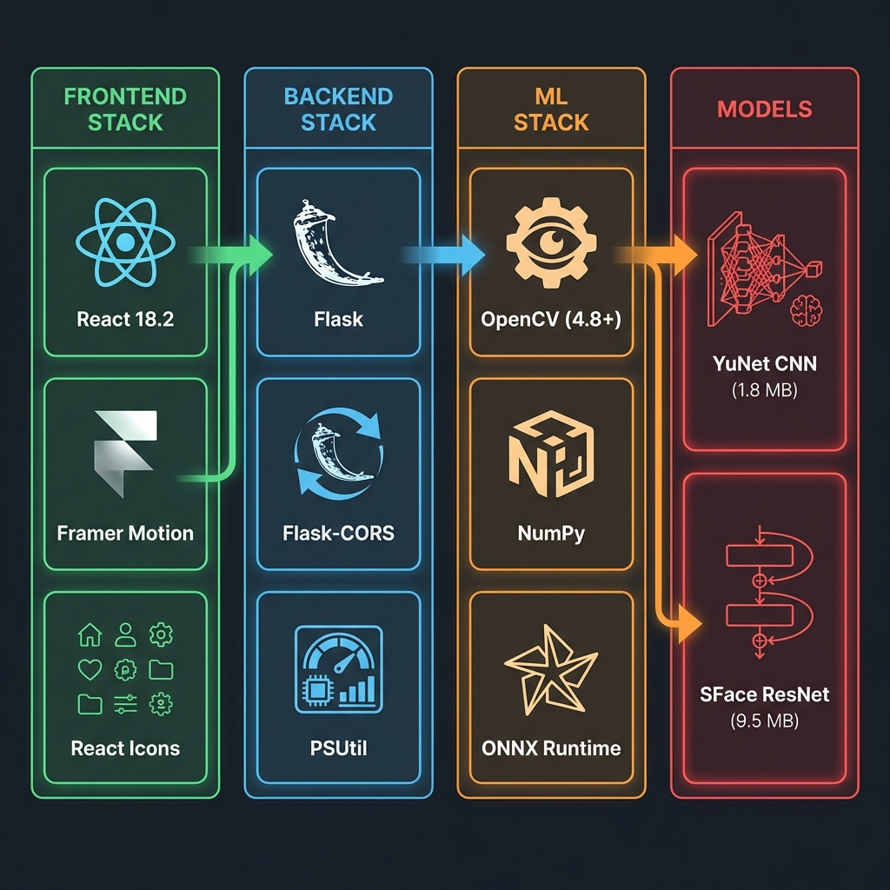

# System Architecture Documentation

> Comprehensive architecture overview for the Person Re-Identification System

---

## 1. System Architecture Diagram

**Purpose:** Shows the complete system structure across all layers - from user interface to ML models.

**Key Components:**
- **Client Layer**: Web browser and React frontend (Port 3000/3001)
- **Application Layer**: Flask REST API (Port 5000) with routing
- **ML Layer**: Python scripts for Re-ID and Harry Potter Cloak
- **Model Layer**: ONNX models (YuNet CNN, SFace ResNet) and storage

**Flow:** User → Frontend → Backend API → ML Scripts → Models → Camera → Results


---

## 2. Data Flow Diagram (DFD)

**Purpose:** Illustrates how data moves through the system from input to output.

**Level 1 (Detailed):** Breaks down into 6 processes:
1. Web Interface - User interactions
2. API Server - Request handling
3. Process Manager - ML script lifecycle
4. Face Detection - YuNet processing
5. Feature Extraction - SFace embeddings
6. Identity Matching - Cosine similarity

**Data Stores:**
- Gallery DB (pickle files) - Stored identities
- Model Files - ONNX models



---

## 3. Application Flowchart

**Purpose:** Complete user journey showing every decision point and action from app launch to result display.

**Key Decision Points:**
- Backend running check
- User action selection (Get Started / Watch Demo / Launch)
- Model download check
- Face detection success
- Re-ID mode (Registration vs Matching)
- Similarity threshold check

**Outcomes:**
- Documentation/Demo display
- ML model launch
- Face registration
- Identity matching with confidence scores



---

## 4. ML Pipeline Flowchart

**Purpose:** Detailed view of the machine learning processing pipeline from raw camera input to final output.

**Pipeline Stages:**
1. **Input**: Camera frame (640x480 RGB)
2. **Preprocessing**: Resize and normalize
3. **Detection**: YuNet CNN finds faces
4. **Alignment**: Affine transform using 5 landmarks
5. **Cropping**: Extract 112x112 face region
6. **Feature Extraction**: SFace ResNet generates 128D embedding
7. **Normalization**: L2 normalize embedding vector
8. **Matching**: Cosine similarity vs gallery (threshold: 0.363)
9. **Output**: Identity label + confidence score

**Models Used:**
- YuNet: Lightweight CNN (1.8 MB, 30-50 FPS)
- SFace: ResNet-50 (9.5 MB, 50-100 FPS)



---

## 5. Component Interaction Diagram

**Purpose:** Sequence diagram showing real-time communication between all system components.

**Interaction Flow:**
1. User clicks "Launch Project" button
2. Frontend sends POST request to backend
3. Backend spawns Python ML script
4. ML script loads ONNX models
5. Camera opens and starts capturing
6. For each frame:
   - YuNet detects faces
   - SFace extracts features
   - System compares with gallery
   - Results displayed to user

**Communication Protocols:**
- Frontend ↔ Backend: HTTP REST API
- Backend ↔ ML Script: subprocess
- ML Script ↔ Models: ONNX Runtime
- ML Script ↔ Camera: OpenCV



---

## 6. Technology Stack Diagram

**Purpose:** Visual representation of all technologies, frameworks, and libraries used in the project.

**Frontend Stack:**
- React 18.2 - UI framework
- Framer Motion - Animations
- React Icons - Icon library

**Backend Stack:**
- Flask - Web framework
- Flask-CORS - Cross-origin support
- PSUtil - Process management

**ML Stack:**
- OpenCV 4.8+ - Computer vision
- NumPy - Numerical computing
- ONNX Runtime - Model inference

**Models:**
- YuNet CNN (1.8 MB) - Face detection
- SFace ResNet (9.5 MB) - Face recognition



---

## Performance Metrics

| Component | Metric | Value |
|-----------|--------|-------|
| Frontend | Render Time | <100ms |
| Backend | API Response | <50ms |
| YuNet | FPS (CPU) | 30-50 |
| SFace | FPS (CPU) | 50-100 |
| Total Latency | End-to-End | <50ms |
| Accuracy | Recognition | 99.5%+ |

---

## File Structure

```
person-reidentification/
├── docs/                        # Architecture diagrams
│   ├── system_architecture.png
│   ├── data_flow_diagram.png
│   ├── ml_pipeline.png
│   ├── component_interaction.png
│   ├── technology_stack.png
│   └── application_flowchart.png
├── frontend/                    # React Application
│   ├── src/components/         # UI Components
│   └── package.json
├── backend/                     # Flask API
│   └── app.py
├── reidentification/           # ML Scripts
│   ├── realtime_reid_robust.py
│   └── face_models/            # ONNX Models
├── README.md
└── ARCHITECTURE.md             # This file
```
