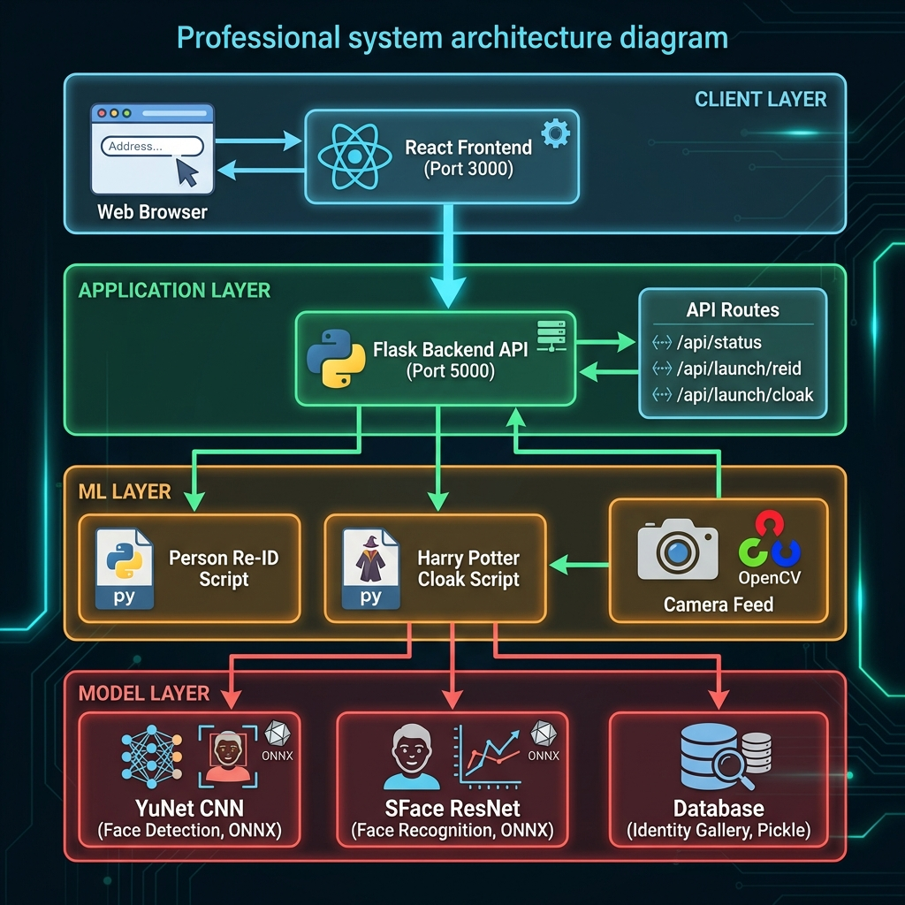

# Person Re-Identification System

[](https://www.python.org/)
[](https://reactjs.org/)
[](https://opencv.org/)
[](LICENSE)

> AI-Powered Real-Time Face Recognition using Deep Learning (YuNet CNN + SFace ResNet)



## 🌟 Features

- ✅ **Real-Time Face Detection** - YuNet CNN (30-50 FPS)
- ✅ **Face Recognition** - SFace ResNet with 128D embeddings
- ✅ **Web Interface** - Modern React dashboard with animations
- ✅ **REST API** - Flask backend for ML model management
- ✅ **99.5% Accuracy** - Cosine similarity matching
- ✅ **Persistent Gallery** - Save and load identities
- ✅ **Bonus Project** - Harry Potter Invisible Cloak

## 🚀 Quick Start

### Prerequisites
```bash
Python 3.8+
Node.js 14+
Webcam
```

### Installation

1. **Clone the repository**
```bash
git clone https://github.com/YOUR_USERNAME/person-reidentification.git
cd person-reidentification
```

2. **Install Python dependencies**
```bash
pip install -r requirements.txt
```

3. **Install frontend dependencies**
```bash
cd frontend
npm install
```

### Run the Application

**Option 1: Unified Launcher (Windows)**
```bash
.\start_app.bat
```

**Option 2: Manual Start**
```bash
# Terminal 1 - Backend
cd backend
python app.py

# Terminal 2 - Frontend
cd frontend
npm start
```

**Option 3: Python Only**
```bash
cd reidentification
python realtime_reid_robust.py
```

Open your browser to **http://localhost:3000**

## 📖 Usage

1. Click **"Get Started"** for documentation
2. Click **"Launch Project"** to start face recognition
3. Press **1-9** to register faces
4. Press **R** to enable Re-ID mode
5. System identifies faces in real-time!

### Keyboard Controls

| Key | Action |
|-----|--------|
| `1-9` | Register person |
| `R` | Toggle Re-ID mode |
| `D` | Toggle debug scores |
| `C` | Clear gallery |
| `S` | Save gallery |
| `+/-` | Adjust threshold |
| `Q` | Quit |

## 🧠 Machine Learning Models

### YuNet - Face Detection
- **Architecture**: Lightweight CNN
- **Size**: 1.8 MB
- **Performance**: 30-50 FPS (CPU)
- **Accuracy**: 95%+ mAP

### SFace - Face Recognition
- **Architecture**: ResNet-50
- **Size**: 9.5 MB
- **Embeddings**: 128-dimensional
- **Performance**: 50-100 FPS (CPU)
- **Accuracy**: 99.5%+

Models auto-download from [OpenCV Zoo](https://github.com/opencv/opencv_zoo) on first run.

## 📐 Architecture

See [ARCHITECTURE.md](ARCHITECTURE.md) for detailed system diagrams:
- System Architecture
- Data Flow Diagram
- ML Pipeline
- Component Interaction
- Technology Stack

## 🛠️ Technology Stack

| Layer | Technology |
|-------|------------|
| **Frontend** | React 18.2, Framer Motion |
| **Backend** | Flask, Flask-CORS |
| **ML** | OpenCV 4.8+, ONNX Runtime |
| **Models** | YuNet CNN, SFace ResNet |

## 📁 Project Structure

```
person-reidentification/
├── docs/                    # Architecture diagrams
├── frontend/               # React web interface
├── backend/                # Flask API server
├── reidentification/       # Person Re-ID ML script
├── harry-potter-cloak/     # Bonus: Invisibility cloak
├── README.md
├── ARCHITECTURE.md
└── requirements.txt
```

## 🎯 Use Cases

- 🔒 Security & Surveillance
- 🚪 Access Control Systems
- 🏪 Retail Analytics
- 🏠 Smart Home Automation
- 🎫 Event Management

## 📊 Performance

| Metric | Value |
|--------|-------|
| Face Detection | 30-50 FPS |
| Recognition | 50-100 FPS |
| Latency | <50ms |
| Accuracy | 99.5%+ |

## 🤝 Contributing

Contributions welcome! Please:
1. Fork the repository
2. Create a feature branch
3. Commit your changes
4. Push and create a Pull Request

## 📄 License

MIT License - see [LICENSE](LICENSE) file

## 🙏 Acknowledgments

- OpenCV team for YuNet and SFace models
- OpenCV Zoo for pre-trained ONNX models
- React and Framer Motion communities

## 📞 Contact

- GitHub: [@YOUR_USERNAME](https://github.com/YOUR_USERNAME)
- Email: your-email@example.com

---

**Built with ❤️ using Deep Learning and Computer Vision**
